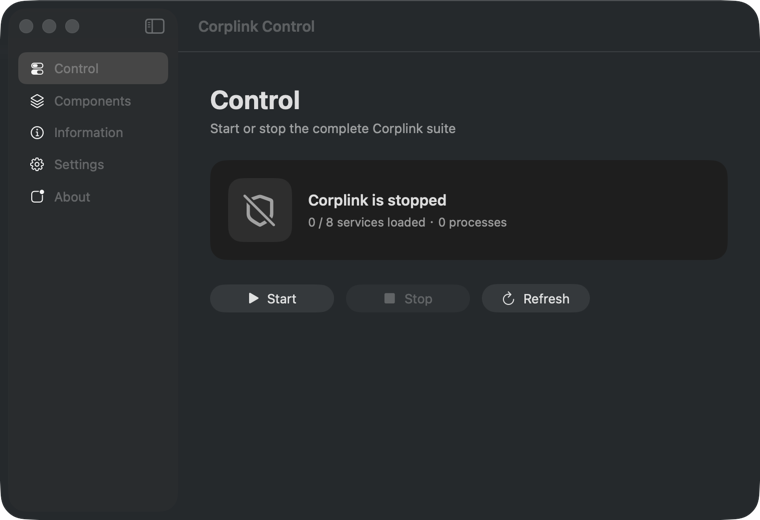
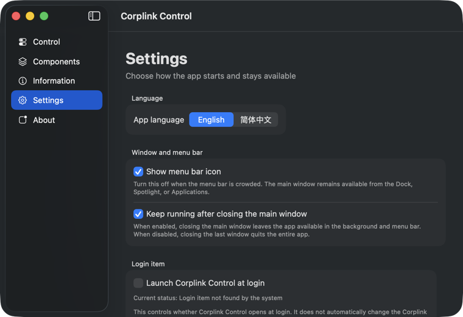

# Corplink Control


Corplink Control is a native macOS app for inspecting, starting, and cleanly stopping the complete Corplink runtime. It covers the connection service, system protection, Network Monitor, MDM, policy forwarding, network agent, application control, and client login task. Universal builds support both Apple Silicon and Intel Macs.

The app opens in English by default and can be switched to Simplified Chinese in Settings.





## What it provides

- One clear **Start** action for the complete installed suite.
- One verified **Stop** action for all known Corplink jobs and processes.
- A compact main window with live service and process counts.
- Detailed component state, PIDs, plist flags, disabled-policy state, and recovery information on secondary pages.
- Optional menu bar icon for quick access.
- A snow-themed anime app icon and a lightweight snowflake menu bar indicator with distinct running, stopped, checking, and inconsistent states.
- A setting that decides whether closing the main window keeps the app running in the background or quits the entire app.
- Optional launch at login.
- English and Simplified Chinese interfaces; English is the default.

Status refreshes silently every 30 seconds only while the main window is visible and the app is active. Closing, minimizing, or putting the app in the background stops automatic status scans, keeping idle resource use low.

## Install with Homebrew

This personal GitHub repository contains both the source and the Homebrew Cask. No separate tap repository is required:

```bash
brew tap jk625x/corplink-control https://github.com/jk625x/corplink-control
brew trust --cask jk625x/corplink-control/corplink-control
brew install --cask jk625x/corplink-control/corplink-control
```

Homebrew calls any third-party formula or Cask repository a “tap”; the command above uses this project repository itself. Homebrew 6 requires explicit trust before loading a third-party Cask, so `brew trust --cask` trusts only this Cask.

To upgrade later:

```bash
brew update
brew upgrade --cask jk625x/corplink-control/corplink-control
```

To uninstall:

```bash
brew uninstall --cask jk625x/corplink-control/corplink-control
```

This build is ad-hoc signed and is not notarized with an Apple Developer ID. If macOS blocks the first launch, open **System Settings > Privacy & Security** and choose **Open Anyway**.

## Start and stop semantics

**Stop** cleanly stops the complete known Corplink suite. The helper asks the vendor CLI to disconnect VPN and SWG, unloads eight known jobs from the correct launchd domains, terminates only matching orphan processes, restores any original `schg` or `uchg` flags, and watches for five seconds to detect a restart. The UI reports a clean stop only when no known job, process, auxiliary process, or active known System Extension remains.

**Start** does not restore a historical subset. It starts every installed component that is not disabled by macOS or organization policy, in dependency order, and verifies each result. For `com.corplink.networkmonitor`, which uses `LaunchOnlyOnce=true`, the helper registers a new launchd job from the vendor's unchanged original plist. It does not remove that safety flag or launch the binary directly. A Mac restart remains the safe fallback if registration verification fails.

The app never deletes Corplink files and never force-enables a job disabled by policy. It is a reversible runtime controller, not an uninstaller.

See [Stopping model, implementation, and verification](docs/STOPPING.md) for the component inventory, exact checks, live test evidence, and known boundaries. A read-only audit is also available:

```bash
./scripts/audit-stop.sh
```

## Build from source

Requirements: macOS 13 or newer and the Swift toolchain included with Xcode Command Line Tools.

```bash
./build-app.sh
```

The universal app is created at `dist/Corplink Control.app`. Reading status does not require elevated privileges. macOS asks for administrator authorization only when a component is started or stopped.

The current release uses AppleScript's administrator authorization flow, which is suitable for personal distribution. A larger public distribution should use Developer ID signing, notarization, and a ServiceManagement privileged helper.
